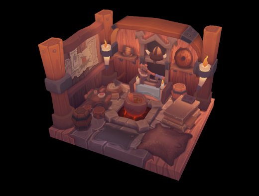

# VulkanEngine

This is a small game engine I'm working on that uses vulkan.

I'm currently learning vulkan and this engine was done by following <a href="https://vulkan-tutorial.com/"> the official vulkan tutorial </a>.

## Compile

*Currently, this can't be easily compiled on Windows or MacOS. If you want you can modify the CMakeLists.txt to fit your needs*

* You will need :
  - make
  - cmake
  - a c++ compiler

* Make sure you have the required libraries :
  - vulkan
  - glm
  - glfw

* Clone the repo
 `git clone https://github.com/ClementChambard/VulkanEngine.git`

* Create a build directory
 `mkdir build && cd build` 
 
* Run cmake to configure the project
 `cmake ..`
 
* Run make to compile
 `make`
 
* Copy or link the assets directory in the build directory
 `ln -s ../assets`

* Run the executable
 `./VulkanTest`

## Contact

for further questions, contact me at clement.chambard@universite-paris-saclay.fr
